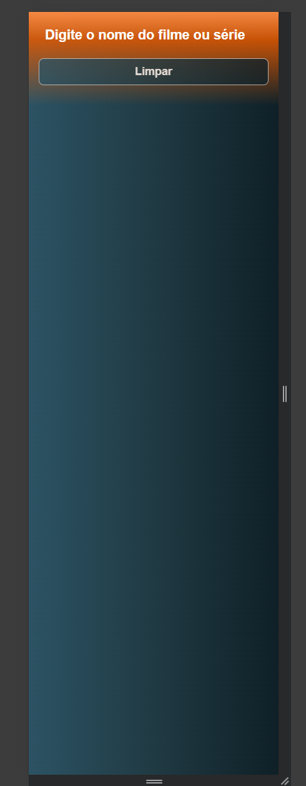
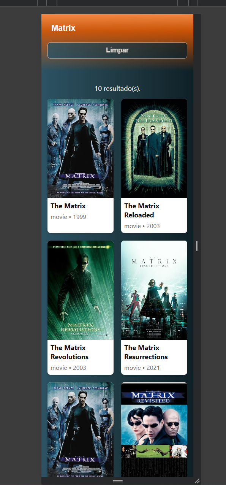
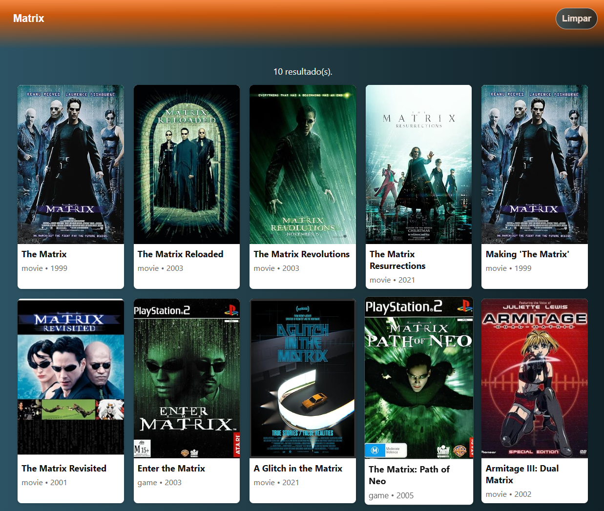
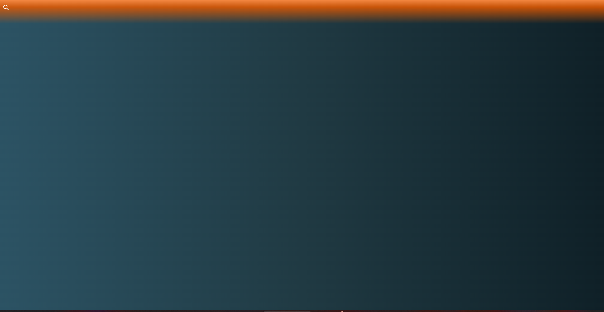

# Teste Claro

Aplicação desenvolvida em JavaScript puro (Vanilla JS) para consumir a API pública do OMDb e exibir resultados de filmes de forma dinâmica.

A interface apresenta um design minimalista, utilizando um gradiente suave para unir o cabeçalho e o corpo da página, proporcionando uma transição visual agradável.

## Como rodar
1. execute o index.html em um browser

## Funcionalidades
* Busca de filmes utilizando a API pública do OMDb e a função fetch().

* Controle de requisições com debounce para evitar múltiplas chamadas durante a digitação.

* Exibição de detalhes adicionais ao interagir com o card (hover e click).

* Cache em memória implementado com Map() para reduzir chamadas repetidas à API.

* Substituição automática de pôsteres ausentes por um placeholder em SVG.

* Layout responsivo, adaptado para uso em diferentes tamanhos de tela.

## Conceitos

* O CSS está subdividido em grupos (*, tags,ids, classes, @media).
* O html segue como padrão a ser aplicado com o bom uso de tags semanticas e padrões com os ids.

----------------------------------------------------------------------------------

Mobile

Desktop

